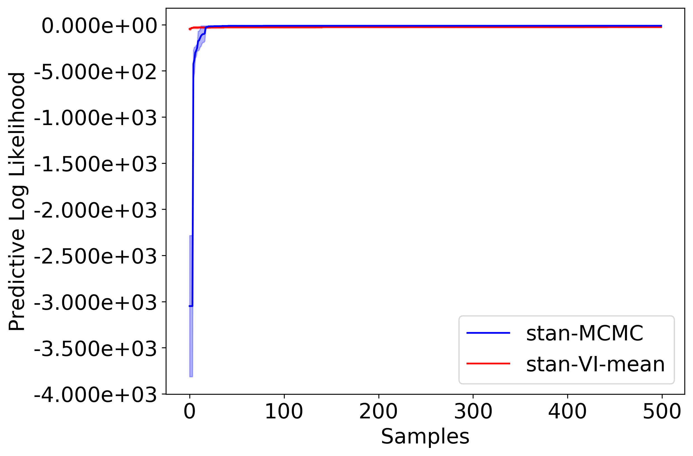

# Getting Started with PPL Bench

* [What is PPL Bench?](#what-is-ppl-bench)
* [Installing](#installing)
* [Getting Started](#getting-started)


## What is PPL Bench?

PPL Bench is a new benchmark framework for evaluating the performance of probabilistic programming languages (PPLs).


## Installing

1. Download/Clone PPL Bench:

    `git clone https://github.com/facebookresearch/pplbench.git`

2. Installing dependencies:
    1. Enter a virtual (or conda) environment
    2. PPL Bench core:

        `pip install -r requirements.txt`
    3. Install PPLs that you wish to benchmark. For instructions, see [Installing PPLs](docs/ppl_installation_instructions.md). Let's install PyStan so we can run the example run below.

        `pip install pystan`

## Getting Started

Let's dive right in with a benchmark run of Bayesian Logistic Regression. Run the following command:

```
python -m pplbench examples/example.json
```

This will create a benchmark run with two trials of Stan on the Bayesian Logistic Regression model. The results of the run are saved in the `pplbench/outputs/` directory.

This is what the PLL plot should look like:


Please see the [examples/example.json](examples/example.json) file to understand the schema for specifying benchmark runs. The schema is documented in [pplbench/main.py](pplbench/main.py) and can be printed by running the help command:

```
python -m pplbench -h
```

A number of models is available in the `pplbench/models` directory and the PPL implementations are available in the `pplbench/ppls` directory.

Please feel free to submit pull requests to modify an existing PPL implementation or to add a new PPL or model.


## Join the PPL Bench community

 For more information about PPL Bench, refer to

1. Website: [LINK TO WEBSITE]
2. Blog post: [LINK TO BLOG POST]
3. Paper: [LINK TO PAPER]

See the [CONTRIBUTING.md](CONTRIBUTING.md) file for how to help out.

## License

This source code is licensed under the MIT license found in the
LICENSE file in the root directory of this source tree.
