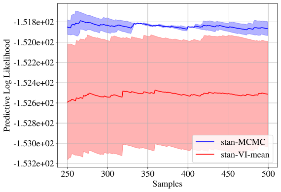

[]((https://facebookresearch.github.io/pplbench/))


[](https://github.com/facebookresearch/pplbench/actions?query=workflow%3Abuild)
[](https://pypi.org/project/pplbench/)

# Getting Started with PPL Bench

* [What is PPL Bench?](#what-is-ppl-bench)
* [Installing](#installation)
* [Getting Started](#getting-started)


## What is PPL Bench?

PPL Bench is a new benchmark framework for evaluating probabilistic programming languages (PPLs).

## Installation

1. Enter a virtual (or conda) environment
2. Install PPL Bench core via pip:

```
pip install pplbench
```

3. Install PPLs that you wish to benchmark. For PPL-specific instructions, see [Installing PPLs](docs/working_with_ppls.md).
You could also run the following command to install all PPLs that are currently supported by PPL Bench (except for Jags):

```
pip install pplbench[ppls]
```

Alternatively, you could also install PPL Bench from source. Please refer to [Installing PPLs](docs/working_with_ppls.md)
for instructions.

## Getting Started

Let's dive right in with a benchmark run of Bayesian Logistic Regression. To run this, you'll need to install
PyStan (if you haven't already):

```
pip install pystan
```

Then, run PPL Bench with example config:

```
pplbench examples/example.json
```

This will create a benchmark run with two trials of Stan on the Bayesian Logistic Regression model. The results of the run are saved in the `outputs/` directory.

This is what the Predictive Log Likelihood (PLL) plot should look like:




Please see the [examples/example.json](examples/example.json) file to understand the schema for specifying benchmark runs. The schema is documented in [pplbench/main.py](pplbench/main.py) and can be printed by running the help command:

```
pplbench -h
```

A number of models is available in the `pplbench/models` directory and the PPL implementations are available in the `pplbench/ppls` directory.

Please feel free to submit pull requests to modify an existing PPL implementation or to add a new PPL or model.


## Join the PPL Bench community

 For more information about PPL Bench, refer to

1. Blog post: [link](https://ai.facebook.com/blog/ppl-bench-creating-a-standard-for-benchmarking-probabilistic-programming-languages)
2. Paper: [link](https://arxiv.org/abs/2010.08886)
3. Website: [link](https://facebookresearch.github.io/pplbench/)

See the [CONTRIBUTING.md](CONTRIBUTING.md) file for how to help out.

## License

This source code is licensed under the MIT license found in the
LICENSE file in the root directory of this source tree.
