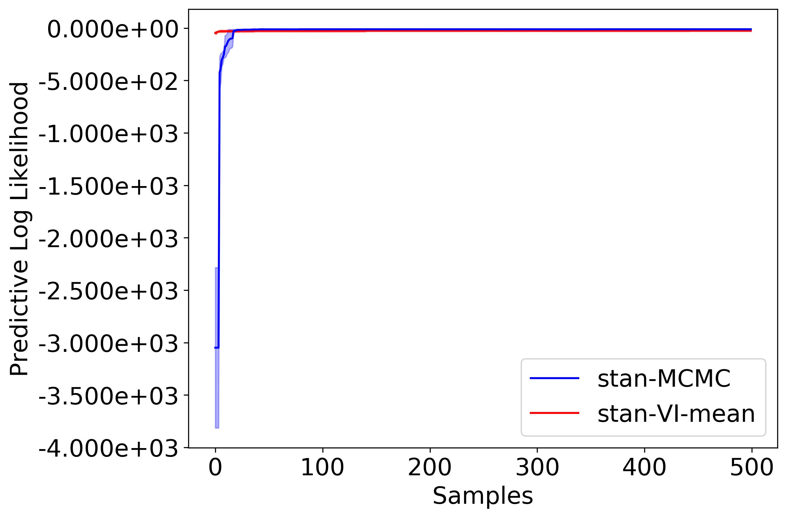

This document outlines how to get started with PPL Bench.

Before jumping into the project, we recommend you read [Introduction](introduction.md) and [System Overview](system_overview.md) documents.

## Installing PPL Bench

1. Download/Clone PPL Bench:

    `git clone https://github.com/facebookresearch/pplbench.git`

2. Installing dependencies:
    1. Enter a virtual (or conda) environment
    2. PPL Bench core:

        `pip install -r requirements.txt`

    3. Install PPLs that you wish to benchmark. For instructions, see [Working with PPLs](working_with_ppls.md). Let's install PyStan so we can run the example run below.

        `pip install pystan`

## Launching PPL Bench

Let's dive right in with a benchmark run of Bayesian Logistic Regression. Run the following command:

```
python -m pplbench.main examples/example.json
```

This will create a benchmark run with two trials of Stan on the Bayesian Logistic Regression model. The results of the run are saved in the `pplbench/outputs/` directory.

This is what the PLL plot should look like:



Please see the [examples/example.json](https://github.com/facebookresearch/pplbench/blob/master/examples/example.json) file to understand the schema for specifying benchmark runs. The schema is documented in [pplbench/main.py](https://github.com/facebookresearch/pplbench/blob/master/pplbench/main.py) and can be printed by running the help command:

```
python -m pplbench.main -h
```

A number of models is available in the `pplbench/models` directory and the PPL implementations are available in the `pplbench/ppls` directory.

Please feel free to submit pull requests to modify an existing PPL implementation or to add a new PPL or model.


<!-- ## API References

For an in-depth reference of the various PPL Bench internals, see our [API Reference](ToADD). -->

## Contributing

You'd like to contribute to PPL Bench? Great! Please see [here](https://github.com/facebookresearch/pplbench/blob/master/CONTRIBUTING.md) for how to help out.


## Join the PPL Bench community

 For more information about PPL Bench, refer to

1. Website: [link](https://facebookresearch.github.io/pplbench/)
2. Blog post: [link](https://ai.facebook.com/blog/ppl-bench-creating-a-standard-for-benchmarking-probabilistic-programming-languages)
3. Paper: [link](https://arxiv.org/abs/2010.08886)
