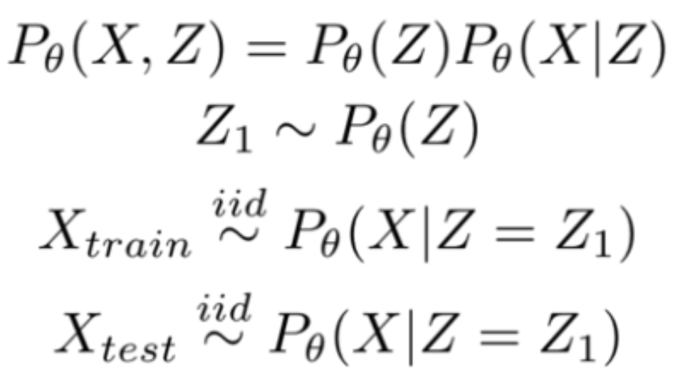
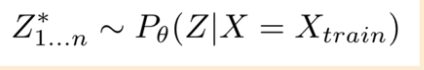
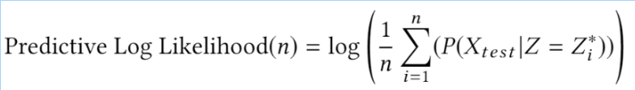

## What is PPL Bench?

PPL Bench is a new benchmark framework for evaluating the performance of probabilistic programming languages (PPLs).

* Model Instantiation and Data Generation

A model with all it's parameters set to certain values is referred to as a model instance.
We then use the generative model to generate two sets of data - train data and test data.
This process of data generation is performed independent of any PPL.

* PPL Implementation and Posterior Sampling

The training data is passed to various PPL implementations to perform inference.

* Evaluation of Posterior Samples

We compute Predictive Log Likelihood on the test data using posterior samples obtained from each PPL. We also compute other common evalutation metrics such as effective sample size, $r_{hat}$ and inference time.

## Using PPL Bench

* Comparing model performance across PPLs
* Comparing the effectiveness of inference algorithms across models
* Evaluating new inference algorithms

## Purpose of PPL Bench

The purpose of PPL Bench as a probabilistic programming benchmark is two-fold.

1. To provide researchers with a framework to evaluate improvements in PPLs in a standardized setting.
2. To enable users to pick the PPL that is most suited for their modelling application.

Typically, comparing different ML systems requires duplicating huge segments of work: generating data, running analysis, determining predictive performance, and comparing across implementations. PPL Bench automates nearly all of this workflow.
