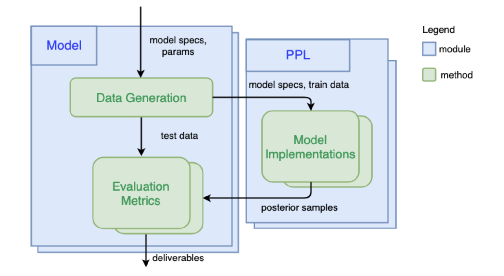

## How PPL Bench works

### 1) Generate Data

The first step is to simulate data (train and test) given the generative model and model parameters. To do this, one can use Numpy or any other Python library that can be used to draws samples from probability distributions. Once this is defined, when benchmarking this model, PPL Bench will use the data generated from this function across all PPLs.

### 2) Implement Model in a PPL

Once we have simulated data for a given model, PPL Bench will go through the PPLs which have implemented the model in question. For every PPL that you want to benchmark against, you will need a corresponding model implementation in that PPL.

### 3) Evaluate Different PPLs

PPL Bench automatically generates predictive log likelihood plots (plotted against samples) on the same test dataset across all PPLs.

We support multiple trials, which runs inference on the same training data, multiple times. Our plots use multiple trials to generate confidence bands in our predictive log likelihood plots.

We also show other important statistics such as effective sample size, inference time, and r_hat.
